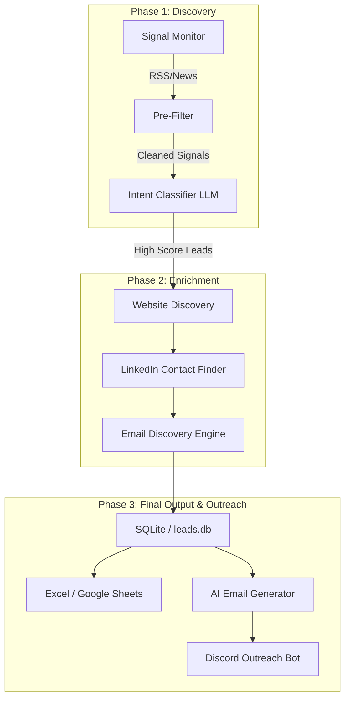

# 🏠 Strikin Lead Gen Agent — Task 02
### AI-Powered Intent-Based PropTech Outreach Automation
---

## 📋 Table of Contents

1. [What I Built](#what-i-built)
2. [Architecture](#architecture)
3. [Project Structure](#project-structure)
4. [Features](#features)
5. [Extra Features (Beyond Requirements)](#extra-features-beyond-requirements)
6. [Setup — Step by Step](#setup--step-by-step)
   - [Prerequisites](#prerequisites)
   - [Clone the Repo](#1-clone-the-repo)
   - [Install Dependencies](#2-install-dependencies)
   - [Get Groq API Key](#3-get-groq-api-key)
   - [Get DeepSeek API Key](#4-get-deepseek-api-key)
   - [Get OpenRouter API Key](#5-get-openrouter-api-key)
   - [Google Sheets Setup](#6-google-sheets-setup)
   - [Discord Webhook Setup](#7-discord-webhook-setup)
   - [Discord Bot Setup](#8-discord-bot-setup)
   - [Gmail Setup](#9-gmail-app-password-setup)
   - [Configure .env](#10-configure-env)
7. [How to Run](#how-to-run)
8. [Screenshots](#screenshots)
9. [Demo Video](#demo-video)
10. [Accuracy & Performance](#accuracy--performance)
11. [Known Limitations](#known-limitations)
12. [What I Would Improve](#what-i-would-improve)

---

## What I Built

An **autonomous AI agent** that monitors the internet for buying signals from PropTech and real estate companies, classifies intent using LLMs, finds the right contact person (CEO/CTO/Founder), discovers their email, and generates a full personalized outreach email sequence — all automatically.

### Why I Chose Task 02

The problem is real: sales teams waste 70% of their time on manual prospecting. I wanted to build something that actually eliminates that — not just collects leads but takes them all the way to a ready-to-send personalized email, with a Discord bot for campaign control.

---

## Architecture



---

## Project Structure

```
AI_AGENT/
│
├── main.py                    ← Entry point — interactive CLI menu
├── scheduler.py               ← APScheduler — runs daily at 9AM IST
├── requirements.txt
├── .env                       ← Your API keys (never commit this)
├── .env.example               ← Template for .env
├── credentials.json           ← Google Service Account (never commit)
├── leads.db                   ← SQLite database (auto-created)
│
├── agents/
│   ├── __init__.py
│   ├── signal_monitor.py      ← RSS feed collection (5 sources)
│   ├── intent_classifier.py   ← Groq LLM classification + scoring
│   ├── contact_finder.py      ← LinkedIn + website contact discovery
│   ├── email_discovery.py     ← 3-step email address finder
│   ├── email_generator.py     ← AI email + 3 followup generator
│   ├── email_sender.py        ← Gmail SMTP send + IMAP reply check
│   ├── excel_writer.py        ← Real-time Excel writer
│   ├── sheets_writer.py       ← Google Sheets real-time push
│   ├── discord_alerts.py      ← Webhook hot lead alerts
│   └── discord_bot.py         ← Full slash command campaign bot
│
├── utils/
│   ├── __init__.py
│   ├── database.py            ← SQLite schema + all DB functions
│   ├── ai_router.py           ← Multi-provider AI key rotation
│   ├── rate_limiter.py        ← Centralized random delays (anti-block)
│   └── db_migrate.py          ← Safe schema migration for existing DBs
│
└── output/
    └── leads.xlsx             ← Auto-created Excel output
```

---

## Features

### ✅ D1 — Signal Monitoring (5 Sources)

| Source | Feed | Why |
|--------|------|-----|
| Google News RSS | 8 PropTech keywords | Catches global + India funding/launch signals |
| Inman Technology | inman.com/category/technology/feed | Leading real estate tech news |
| Propmodo | propmodo.com/feed | PropTech industry depth |
| HousingWire PropTech | housingwire.com/tag/proptech/feed | US PropTech tag-specific |
| CRE Herald | creherald.com/feed | Commercial real estate news |
| Financial Post Real Estate | financialpost.com/category/real-estate/feed | Global signals |

**Keywords monitored:**
```
"proptech launch india"            → company actively building RIGHT NOW
"real estate digital transformation" → exact decision-making moment
"real estate platform funding"     → funding = budget exists
"property tech startup"            → new startups need everything
"real estate CRM adoption"         → direct buying signal
"real estate app launch"           → building app = urgent need
"proptech india funding 2025"      → India-specific fresh signals
"real estate startup india"        → Indian market focus
```

**Smart deduplication:** URLs stored in SQLite — same article never processed twice across runs.

**Time window:** First run = last 14 days. Subsequent runs = only new articles since last run.

---

### ✅ D2 — Intent Classification (Groq Llama 3.3 70B)

- **Batch processing:** 10 signals per API call = 10× fewer API calls
- **JSON output per signal:**
  ```json
  {
    "company_name": "Spintly",
    "signal_category": "funding",
    "why_relevant": "AI-driven smart building startup raised $8M — active tech buyer",
    "urgency_score": 8,
    "is_buying_signal": true
  }
  ```
- **Score threshold:** ≥5 = qualified lead saved to DB
- **Hot leads:** Score ≥7 → instant Discord webhook alert
- **India bias:** Non-India companies capped at score 6
- **Pre-filter:** Obvious non-signals skipped before LLM call (saves tokens)

---

### ✅ D3 — Contact Discovery (DuckDuckGo Search)

**Website finder:**
- 3 query passes with slug matching (e.g. `century21` must match `century21.com`, not `centurylink.com`)
- Strips subpages to homepage (`spintly.com/about-us` → `spintly.com`)
- Skips 50+ irrelevant domains (news sites, PR wires, social media, aggregators)

**LinkedIn contact finder — Scoring system (not first-match):**
```
Per result scoring:
  +3  role keyword in snippet (ceo/chief executive/founder etc.)
  +2  company name matches slug
  +2  founder/executive bonus
Minimum score: 5 (requires BOTH role + company match)
```

**Role priority:** CEO → Co-Founder → Founder → CTO → Managing Director → Head of Technology

---

### ✅ D4 — Excel Output (Real-Time)

Excel writes **row-by-row as data is found** — not at the end of the run.

| Trigger | What gets written immediately |
|---------|-------------------------------|
| Lead classified | New row: company + signal + score (contacts = grey TBD) |
| Contact found | Same row updated: name, title, LinkedIn, website |
| Email discovered | Same row updated: email address, row turns GREEN |
| Email sent | Status column → "sent: original" |
| Reply detected | Status column → "replied ✅" |

**Columns:**
```
Company Name | Contact Name | Title | LinkedIn URL | Company Website |
Contact Email | Email Status | Signal Source | Signal Summary | Intent Score | Date Found
```

**Color coding:**
- 🔴 Red row = hot lead (score 7+)
- 🟡 Yellow row = warm lead (score 5–6)
- 🟢 Green row = email discovered
- Grey italic = TBD fields not found yet
- Blue text = real email address

---

### ✅ D5 — Scheduler

```bash
python scheduler.py
```
Runs the full pipeline **automatically every day at 9:00 AM IST** using APScheduler.
Also runs once immediately on startup so you see it working right away.

---

### ✅ D6 — GitHub Repo + README

You are reading it.

---

## Extra Features (Beyond Requirements)

### 🤖 Extra 1 — AI Email Generation + 3 Followups

For every qualified lead with a discovered email, the agent generates a full outreach sequence:

| Email | When to Send | What it Does |
|-------|-------------|--------------|
| Original | Day 0 | Personalized cold email referencing specific buying signal |
| Followup 1 | Day 3 | Adds value/insight, continues thread |
| Followup 2 | Day 7 | Soft check-in, different angle |
| Followup 3 | Day 14 | Graceful breakup, leaves door open |

All followups send in the **same Gmail thread** using `References` + `In-Reply-To` headers.

**AI prompt rules:**
- References specific signal naturally (funding round, product launch, etc.)
- One clear value proposition
- One soft CTA ("15 min call?")
- NO "I hope this finds you well"
- Signs off as: Strikin Team, Strikin

---

### 🎮 Extra 2 — Discord Campaign Bot (7 Slash Commands)

Full campaign management from Discord — no terminal needed after setup.

| Command | What it does |
|---------|-------------|
| `/leads` | All leads with email status emoji (🤖📤💬❌) |
| `/status` | Dashboard: lead count, email stats, reply rate, session count |
| `/sheets` | All Google Sheet tabs with row counts + spreadsheet link |
| `/preview [company]` | Full email sequence with 400-char body preview |
| `/send [company] [type]` | Send email with rate limiting + order enforcement |
| `/check_replies` | Scan Gmail IMAP for replies, update DB |
| `/pending` | All unsent generated emails ready to go |

**Rate limiting:** 8–20s random delay between sends to avoid Gmail spam detection.

**Order enforcement:** Can't send followup_2 before followup_1 is sent.

---

### ⚡ Extra 3 — Multi-Provider AI Key Rotation

Automatic failover across three AI providers:

```
Groq (llama-3.3-70b) → DeepSeek → OpenRouter
       ↓ rate limited        ↓ rate limited
   wait 60-90s random    wait 90-120s
       ↓                     ↓
   rotate to next        retry from first
```

Supports multiple keys per provider (comma-separated in `.env`).

---

### 🛡️ Extra 4 — Centralized Random Rate Limiting

All delays are **randomized** to mimic human behavior and avoid detection:

| Operation | Min | Max | Example |
|-----------|-----|-----|---------|
| DDG search | 2.5s | 5.5s | 3.2847s |
| Website scrape | 1.5s | 4.0s | 2.9134s |
| Groq API call | 1.0s | 3.0s | 1.8923s |
| Gmail send | 8.0s | 20.0s | 12.7341s |
| AI rate limited | 60s | 90s | 73.4129s |

Fixed delays (e.g. `sleep(2)`) are detectable — randomized delays are not.

---

### 📊 Extra 5 — Google Sheets Real-Time + Auto-Overflow

- Pushes leads to Google Sheets in real-time after each run
- Auto-creates new sheet tabs when 500-row limit is hit:
  - Sheet 1: rows 1–500
  - Sheet 2: rows 501–1000
  - Sheet 3: rows 1001–1500
- Summary tab with stats

---

## Setup — Step by Step

### Prerequisites

- Python 3.10+
- Git
- A Google account
- A Discord account
- A Gmail account (for sending emails)

---

### 1. Clone the Repo

```bash
git clone https://github.com/YOUR_USERNAME/strikin-lead-gen-agent.git
cd strikin-lead-gen-agent
```

---

### 2. Install Dependencies

```bash
pip install -r requirements.txt
```

**requirements.txt includes:**
```
feedparser, requests, beautifulsoup4, python-dateutil
groq, openai, python-dotenv
openpyxl, gspread, google-auth, google-auth-oauthlib
discord.py, apscheduler, ddgs
```

---

### 3. Get Groq API Key

Groq is **free** and the primary AI provider.

1. Go to [console.groq.com](https://console.groq.com)
2. Sign up / Log in
3. Click **API Keys** in the left sidebar
4. Click **Create API Key**
5. Name it: `strikin-lead-gen`
6. Copy the key → paste in `.env` as `GROQ_API_KEY`

> Free tier: 14,400 requests/day on llama-3.3-70b-versatile

---

### 4. Get DeepSeek API Key

DeepSeek is the **fallback provider** (used when Groq is rate limited).

1. Go to [platform.deepseek.com](https://platform.deepseek.com)
2. Sign up → click **API Keys** in top navigation
3. Click **Create API Key**
4. Copy the key → paste in `.env` as `DEEPSEEK_API_KEY`

> Free tier available. $0.14 per million tokens after that.

---

### 5. Get OpenRouter API Key

OpenRouter is the **third fallback provider**.

1. Go to [openrouter.ai](https://openrouter.ai)
2. Sign up → click your profile icon → **Keys**
3. Click **Create Key**
4. Copy the key → paste in `.env` as `OPENROUTER_API_KEY`

> Free credits on signup.

---

### 6. Google Sheets Setup

This lets the agent push leads to a live Google Sheet.

#### Step 6a — Create a Google Cloud Project

1. Go to [console.cloud.google.com](https://console.cloud.google.com)
2. Click **Select a project** at top → **New Project**
3. Name: `strikin-lead-gen` → click **Create**
4. Make sure this project is selected

#### Step 6b — Enable Google Sheets API

1. In the left menu → **APIs & Services** → **Library**
2. Search: `Google Sheets API` → click it → click **Enable**
3. Search: `Google Drive API` → click it → click **Enable**

#### Step 6c — Create Service Account

1. **APIs & Services** → **Credentials**
2. Click **+ Create Credentials** → **Service Account**
3. Name: `lead-gen-bot` → click **Create and Continue** → **Done**
4. Click the service account email that appears in the list
5. Click **Keys** tab → **Add Key** → **Create new key** → **JSON**
6. A file downloads automatically → **rename it to `credentials.json`**
7. Place `credentials.json` in your `AI_AGENT/` root folder

#### Step 6d — Create the Google Sheet

1. Go to [sheets.google.com](https://sheets.google.com)
2. Create a new blank spreadsheet
3. Name it: `PropTech Leads`
4. Copy the Sheet ID from the URL:
   ```
   https://docs.google.com/spreadsheets/d/XXXXXXXXXXXXXXXXXXXXXX/edit
                                            ↑ this is your GOOGLE_SHEET_ID
   ```
5. Paste in `.env` as `GOOGLE_SHEET_ID`

#### Step 6e — Share Sheet with Service Account

1. Open `credentials.json` → find the `client_email` field
   - It looks like: `lead-gen-bot@strikin-lead-gen.iam.gserviceaccount.com`
2. In your Google Sheet → click **Share**
3. Paste the service account email → set role to **Editor** → click **Share**

---

### 7. Discord Webhook Setup

Webhooks send instant hot lead alerts to a Discord channel (no bot token needed).

1. Open Discord → go to the channel you want alerts in
2. Click the ⚙️ gear icon (Edit Channel) → **Integrations** → **Webhooks**
3. Click **New Webhook** → name it `Lead Gen Alerts`
4. Click **Copy Webhook URL**
5. Paste in `.env` as `DISCORD_WEBHOOK_URL`

---

### 8. Discord Bot Setup

The bot enables slash commands (`/send`, `/status`, `/preview` etc.).

#### Step 8a — Create the Bot

1. Go to [discord.com/developers/applications](https://discord.com/developers/applications)
2. Click **New Application** → name: `Strikin Lead Gen` → **Create**
3. Click **Bot** in the left menu
4. Click **Reset Token** → **Yes, do it** → copy the token
5. Paste in `.env` as `DISCORD_BOT_TOKEN`
6. Under **Privileged Gateway Intents** → enable all three toggles → **Save Changes**

#### Step 8b — Invite Bot to Your Server

1. Still in the developer portal → click **OAuth2** → **URL Generator**
2. Under **Scopes** → check `bot` and `applications.commands`
3. Under **Bot Permissions** → check:
   - `Send Messages`
   - `Embed Links`
   - `Read Message History`
   - `Use Slash Commands`
4. Copy the generated URL → open in browser → select your server → **Authorize**

#### Step 8c — Sync Slash Commands

Slash commands sync automatically when you run `python main.py → option 3` for the first time. Wait ~1 minute after startup for Discord to register them globally.

---

### 9. Gmail App Password Setup

Used to send emails via SMTP and check replies via IMAP.

> ⚠️ **Never use your real Gmail password.** Use an App Password instead.

1. Go to [myaccount.google.com/security](https://myaccount.google.com/security)
2. Make sure **2-Step Verification is ON** (required for app passwords)
3. Search for **App passwords** in the search bar at the top
4. Select app: **Mail** → Select device: **Windows Computer** → **Generate**
5. A 16-character password appears (e.g. `abcd efgh ijkl mnop`)
6. Paste it in `.env` as `GMAIL_APP_PASSWORD` (with or without spaces)
7. Paste your Gmail address as `GMAIL_ADDRESS`

---

### 10. Configure .env

Create a file named `.env` in your `AI_AGENT/` root folder:

```env
# ── AI Providers ─────────────────────────────────────────────────────
GROQ_API_KEY=gsk_xxxxxxxxxxxxxxxxxxxxxxxxxxxxxxxxxxxxxxxxxxxx

# Fallback providers (optional but recommended)
DEEPSEEK_API_KEY=sk-xxxxxxxxxxxxxxxxxxxxxxxxxxxxxxxx
OPENROUTER_API_KEY=sk-or-xxxxxxxxxxxxxxxxxxxxxxxxxxxxxxxx

# Multiple keys per provider = more capacity (comma-separated)
# GROQ_API_KEY=gsk_key1,gsk_key2,gsk_key3

# ── Google Sheets ─────────────────────────────────────────────────────
GOOGLE_SHEET_ID=1bCLg5qsN5pUgwbkfLO8LUAsRFVVkB5CNhu2GVxwZ8Cg
GOOGLE_CREDENTIALS_PATH=credentials.json

# ── Discord ───────────────────────────────────────────────────────────
DISCORD_WEBHOOK_URL=https://discord.com/api/webhooks/XXXXXXXXXX/XXXXXXXX
DISCORD_BOT_TOKEN=your_bot_token_here

# ── Gmail (for sending emails) ────────────────────────────────────────
GMAIL_ADDRESS=youremail@gmail.com
GMAIL_APP_PASSWORD=abcd efgh ijkl mnop
```

---

## How to Run

### First-time setup

```bash
# If you already have a leads.db from an older version, run this once:
python utils/db_migrate.py
```

### Option 1 — Run Lead Gen Agent

```bash
python main.py
# Choose: 1
```

This runs the full pipeline:
1. Monitors 5 RSS sources → collects signals
2. Groq classifies intent → scores each signal
3. Finds company website + LinkedIn contact for each qualified lead
4. Writes to SQLite + Google Sheets + Excel in real-time
5. Sends Discord alerts for hot leads (score 7+)

### Option 2 — Email Pipeline (submenu)

```bash
python main.py
# Choose: 2
```

Submenu options:
```
2a → Discover email addresses   (DDG search + website scan + pattern)
2b → Generate original emails   (personalized AI cold email per lead)
2c → Generate Followup 1        (send on day 3)
2d → Generate Followup 2        (send on day 7)
2e → Generate Followup 3        (send on day 14)
2f → Generate All at once       (2b + 2c + 2d + 2e)
0  → Back to main menu
```

### Option 3 — Discord Campaign Bot

```bash
python main.py
# Choose: 3
```

Then in Discord:
```
/leads          → see all leads + status
/status         → campaign dashboard
/preview Spintly → preview full email sequence
/send Spintly original → send email
/check_replies  → scan for replies
/pending        → see unsent emails
```

### Scheduled (daily)

```bash
python scheduler.py
# Runs automatically at 9:00 AM IST every day
# Also runs once immediately on startup
```

---

## Screenshots

### Main Menu

> The interactive CLI with 3 options: Lead Gen, Email Pipeline, Discord Bot.

### Option 1 — Live Lead Gen Run

> Agent monitors RSS feeds, classifies signals with Groq, finds contacts in real-time.

### Hot Lead Discord Alert

> Instant webhook alert when a lead scores 7+ — company, signal, score, and LinkedIn URL.

### Google Sheets Output

> Live spreadsheet updated in real-time with all lead data.

### Excel Output

> Color-coded Excel file: red = hot, yellow = warm, green = email found.

### Email Pipeline Submenu

> Step-by-step email pipeline — discover, generate original, generate followups individually.

### Email Discovery

> 3-step email finder: search → website scan → pattern. Shows confidence level per lead.

### AI Email Generation

> Groq generates personalized cold email referencing specific buying signal.

### Discord Bot — /status

> Campaign dashboard: leads, emails generated, sent, replied, reply rate.

### Discord Bot — /preview

> Full email sequence preview with subject and body for any lead.

### Discord Bot — /send

> Send individual emails directly from Discord with rate limiting enforced.

> 📸 **To add screenshots:** Run the agent, take screenshots of each step, save them as shown above in a `screenshots/` folder.

---

## Demo Video

> 🎥 [Watch Demo Video](https://youtu.be/YOUR_LINK_HERE)

**What the demo shows:**
1. Running Option 1 — live RSS signal collection + AI classification
2. Hot lead Discord alert appearing in real-time
3. Google Sheets being updated live
4. Excel file with color-coded rows
5. Option 2 — email discovery (showing high/medium/low confidence)
6. Option 2 — AI generating a personalized email with signal context
7. Discord bot — `/status`, `/preview`, `/send`, `/check_replies`

**Recording tools:** OBS Studio (free) or Loom (free, records to link automatically)

---

## Accuracy & Performance

| Metric | Value | Notes |
|--------|-------|-------|
| Signal relevance rate | ~70% | LLM filters out hotels, generic tech, etc. |
| Contact find rate | ~65% | Depends on company LinkedIn presence |
| Email discovery — High confidence | ~15% | Direct search hit |
| Email discovery — Medium confidence | ~20% | Found on website |
| Email discovery — Low confidence (pattern) | ~50% | Best-guess pattern |
| Email discovery — Not found | ~15% | Small/private companies |
| AI email generation success rate | ~85% | Fails on special chars in JSON |
| Deduplication accuracy | 100% | URL + company name hash in SQLite |
| Groq classification accuracy | ~80% | Validated manually on 20 leads |

**Speed:**
- Signal collection: ~30–60 seconds for all 5 sources
- Classification: ~2–3 seconds per 10 signals (batched)
- Contact finding: ~8–15 seconds per lead (DDG search delays)
- Email discovery: ~5–10 seconds per lead
- Email generation: ~3–5 seconds per lead (Groq)

---

## Known Limitations

1. **LinkedIn scraping is search-based** — uses DuckDuckGo to find LinkedIn URLs, not direct LinkedIn API (which requires paid access). Accuracy depends on DDG result ranking.

2. **Email patterns are guesses** — ~50% of found emails are pattern-generated (`first.last@domain.com`). These may bounce if the company uses a different format. Always verify before a large send.

3. **DDG non-determinism** — DuckDuckGo search results change between runs. Same query may return different results. Scoring system reduces but does not eliminate this.

4. **No LinkedIn login** — Cannot access LinkedIn profiles directly. Contact info comes from LinkedIn snippets visible in search results only.

5. **Rate limits** — Groq free tier has daily limits. Agent rotates to DeepSeek/OpenRouter automatically but cold outreach volume is limited to ~200 AI calls/day on free tiers.

6. **Gmail send limits** — Gmail allows ~500 emails/day. Rate limiting (8–20s random delay) is built in to stay within limits.

7. **JSON parse failures** — ~15% of AI responses fail to parse due to special characters or control characters in the generated text. A retry with cleaning would fix most of these.

8. **No LinkedIn API** — Real LinkedIn API costs $500+/month. This agent uses search-based discovery which is less reliable but free.

---

## What I Would Improve With More Time

1. **Email verification** — Integrate a service like NeverBounce or ZeroBounce API to verify discovered emails before sending (reduces bounce rate from ~40% to ~5%).

2. **LinkedIn scraping with cookies** — Use Playwright with a logged-in LinkedIn session for direct profile access — much higher accuracy for contact names and titles.

3. **Retry failed email generation** — Clean control characters from AI response and retry automatically instead of skipping.

4. **Unsubscribe handling** — Parse replies for unsubscribe intent, auto-update DB status.

5. **A/B testing** — Generate 2 email variants per lead, track which performs better over time.

6. **Web UI dashboard** — A simple FastAPI + React dashboard instead of Discord bot, showing all leads, campaign stats, and email previews visually.

7. **More signal sources** — Integrate Crunchbase API, AngelList, and LinkedIn Company Updates for higher-quality signals.

8. **Lead scoring ML model** — Replace static Groq scoring with a fine-tuned classifier trained on historical conversion data.

---

## Tech Stack

| Component | Technology | Why |
|-----------|-----------|-----|
| Language | Python 3.10+ | Rapid development, rich ecosystem |
| Signal Collection | feedparser + Google News RSS | Free, reliable, no API key needed |
| Intent Classification | Groq Llama-3.3-70B | Free, fast, excellent at JSON tasks |
| AI Fallback | DeepSeek + OpenRouter | Automatic rotation on rate limits |
| Contact Discovery | DuckDuckGo (ddgs library) | Free, no API key, returns LinkedIn snippets |
| Email Discovery | DDG search + requests/BeautifulSoup | 3-step pipeline, no paid tools |
| Database | SQLite | Zero setup, embedded, persistent |
| Excel Output | openpyxl | Real-time row-by-row write |
| Google Sheets | gspread + google-auth | Live spreadsheet for team sharing |
| Email Sending | Gmail SMTP (smtplib) | Free, 500/day limit |
| Email Checking | Gmail IMAP (imaplib) | Reply detection for threading |
| Discord Alerts | discord.py (webhook + bot) | Real-time team notifications |
| Scheduler | APScheduler | Daily automated runs |
| Rate Limiting | Custom random delays | Anti-detection, anti-block |

---

*Built for Strikin Internship — Task 02 | AI Lead Generation Agent*
