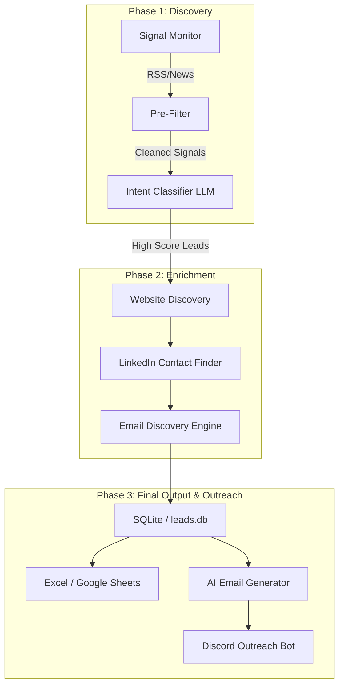

# 🤖 AI Lead Generation Agent — Intent-Based Outreach

## 🌟 Project Overview
This project is an **Autonomous AI sales lead generation system** designed to solve the problem of manual prospecting. It monitors the internet for high-intent buying signals from a specific Ideal Customer Profile (ICP), extracts decision-maker contacts, and automates outreach.

### 🎯 Ideal Customer Profile (ICP)
- **Segment**: Real Estate companies or developers planning to digitalize operations, launch digital platforms, or adopt PropTech solutions.
- **Intent Signals**: News about digital transformation, hiring tech teams, launching apps, adopting CRM tools, or raising funds for tech upgrades.
- **Target Contacts**: CEO, Co-Founder, CTO, or Head of Technology.

---

## 🏗 System Architecture
The system is built as a modular pipeline where specialized agents handle different stages of the lead lifecycle.



---

## � Features Breakdown

### 1. 📡 Signal Monitoring (Assignment Task)
The agent polls multiple high-authority sources to catch leads at the exact moment of intent.
- **Google News RSS**: Real-time monitoring of global and India-specific PropTech keywords.
- **Industry-Specific Feeds**: Scrapes RSS from `Inman`, `Propmodo`, and `HousingWire`.
- **Business/Tech Journals**: Monitors `The Ken`, `CRE Herald`, `Livemint`, and `Financial Post`.
- **Smart Deduplication**: Never processes the same URL or company twice.

### 2. 🧠 AI Intent Classification (Assignment Task)
- **LLM**: Powered by **Llama 3.3 70B** for superior reasoning and speed.
- **Urgency Scoring**: Labels leads from 1–10 based on how likely they are to need PropTech tools.
- **Categorization**: Automatically tagging leads as `FUNDING`, `LAUNCH`, `HIRING`, or `DIGITAL_TRANSFORM`.

### 3. 🔍 Contact Discovery (Assignment Task)
- **Deep Web Search**: Automatically finds the company's official website.
- **LinkedIn Logic**: Scours LinkedIn for C-level executives (CEO, CTO, Founders).
- **Intelligent Parsing**: Extracts clean names and titles from search snippets.

### 4. 📈 Automated Output (Assignment Task)
- **Excel Generation**: Local `leads.xlsx` updated in real-time.
- **Google Sheets Sync**: Live syncing of leads for team-wide access.
- **SQLite Persistence**: Local database for historical tracking.

### 5. ✉️ AI Email Sequence Pipeline (Extra Feature)
- **Pattern Matching**: Guesses corporate emails based on common naming conventions.
- **Personalized Writing**: AI writes a unique original email + **3 follow-ups** tailored to the specific lead's intent signal.

### 6. 🤖 Discord Bot Integration (Extra Feature)
- **Hot Lead Alerts**: Real-time notifications for leads with an intent score of 7+.
- **Interactive Outreach**: Send original or follow-up emails directly from Discord using slash commands.
- **Campaign Dashboard**: View stats like "Generated vs Sent vs Replied" inside Discord.

---

## ⚙️ Setup & Installation

### 1. Clone the Repository
```bash
git clone <your-repo-url>
cd AI_AGENT
```

### 2. Install Dependencies
```bash
pip install -r requirements.txt
```

### 3. Configure `.env` File
Create a `.env` file in the root. You will need to obtain the following keys across four categories:

#### 🔑 Category A: AI Keys (LLM Logic)
1. **GROQ_API_KEY**:
   - Go to [Groq Console](https://console.groq.com/keys).
   - Create a new API Key. (Used for primary classification).
2. **OPENROUTER_API_KEY**:
   - Go to [OpenRouter](https://openrouter.ai/keys).
   - Create a key. (Used as a fallback for high-quality reasoning).

#### 💬 Category B: Discord (Alerts & Outreach)
1. **DISCORD_BOT_TOKEN**:
   - Visit [Discord Developer Portal](https://discord.com/developers/applications).
   - Create a 'New Application', go to 'Bot', and click 'Reset Token'.
   - Enable "Message Content Intent" in the Bot settings.
2. **DISCORD_CHANNEL_ID**:
   - Enable 'Developer Mode' in Discord Settings (Advanced).
   - Right-click the target channel in your server -> 'Copy Channel ID'.
3. **DISCORD_WEBHOOK_URL**:
   - Channel Settings -> Integrations -> Webhooks -> New Webhook -> 'Copy Webhook URL'.

#### 📊 Category C: Google (Storage & Sync)
1. **GOOGLE_SHEET_ID**:
   - The long string in your Google Sheet's URL: `docs.google.com/spreadsheets/d/YOUR_SHEET_ID/edit`.
2. **GOOGLE_CREDENTIALS_PATH**:
   - Go to [Google Cloud Console](https://console.cloud.google.com/).
   - Create a project -> Enable 'Google Sheets API' & 'Google Drive API'.
   - Create a 'Service Account' -> 'Keys' -> 'Add Key' -> 'Create New Key (JSON)'.
   - Save the JSON file as `credentials.json` in the project folder.
   - **Important**: Share your Google Sheet with the email address found in the `client_email` field of your JSON file.

#### 📧 Category D: Gmail (Email Sending)
1. **GMAIL_ADDRESS**: Your outreach email.
2. **GMAIL_APP_PASSWORD**:
   - Go to your Google Account Settings -> Security.
   - Enable 2-Factor Authentication.
   - Search for "App Passwords" -> Create one for 'Mail' with a custom name.
   - **Note**: Do NOT use your regular password; use the 16-character code generated.

---

## 🚀 How to Run

Launch the interactive CLI menu:
```bash
python main.py
```

### Options:
1. **Run Lead Gen Agent**: Executes the full discovery loop (Signals -> Classify -> Contacts).
2. **AI Email Pipeline**: Discover emails and generate the 4-step sequence (Original + 3 Follow-ups).
3. **Launch Discord Bot**: Starts the bot for real-time alerts and outreach commands.

---

## � Deliverables Summary
- **Signal Monitoring**: Polls 2+ sources and filters for ICP-relevant signals.
- **Intent Classifier**: Scores urgency (1-10) with reasoning.
- **Contact Discovery**: Finds CEO/CTO LinkedIn URLs.
- **Output Export**: Deduplicated Excel and Google Sheets storage.
- **Scheduler**: Integrated for automated or manual triggers.

---

## 📄 Submission Info
- **Assignment**: AI Lead Generation Agent
- **Submitted to**: deepesh.j@strikin.com
